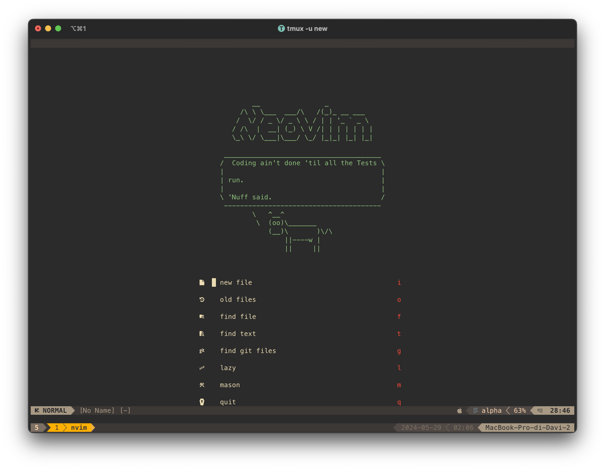
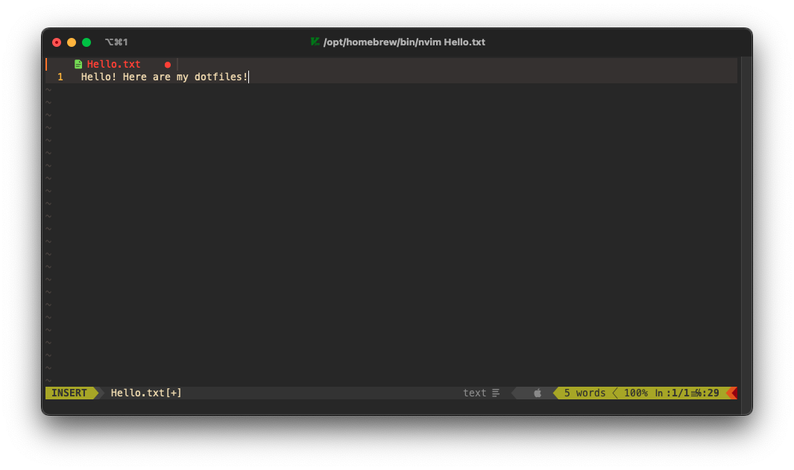

# Dotfiles

<!--toc:start-->

- [Dotfiles](#dotfiles)
  - [Requirements](#requirements)
  - [Neovim](#neovim) - [Plugins - Neovim](#plugins-neovim) - [Key bindings](#key-bindings)
  <!--toc:end-->

Welcome to my dotfiles!

I am always trying new stuff, so not everything in this readme may be
up-to-date.

> Neovim - Startup
> 
>
> Neovim - Editing a file
> 

## Quickstart

You can test these dotfiles using the [Devcontainer definition](./.devcontainer/devcontainer.json).

It uses my custom [Dev Environment feature](https://github.com/davmacario/devcontainer-features/tree/main/src/dev-environment) to automatically install all requirements and set up the environment using the [`./setup.sh` script](./setup.sh).

---

**Note**: for a specific configuration select the specific branch

---

General contents:

- [.zshrc](./.zshrc): ZSH configuration file (using Oh My Zsh)
- [.vimrc](./.vimrc): VIM configuration file (requires Vundle)
- [.p10k.zsh](./.p10k.zsh): Powerlevel10k (ZSH theme) settings file
- [nvim folder](./nvim): Neovim configuration files (using Lua)

## Requirements

- C compiler (gcc)
- [Oh My Zsh](https://ohmyz.sh/)
- [Powerlevel10k](https://github.com/romkatv/powerlevel10k)
- Neovim (>=0.9.0)
  - Install via package manager (recommended for mac, via homebrew)
  - For Ubuntu, since the neovim version found in the apt repository is older, I
    compile Neovim from source
- `fd` (`brew/sudo apt-get install fd-find`)
- fzf (`brew/sudo apt-get install fzf`)
- [pngpaste](https://github.com/jcsalterego/pngpaste)

Extras:

- MesloNGS LF fonts (see
  [this](https://github.com/romkatv/powerlevel10k/blob/master/font.md))
- Neofetch (via package manager)
- `htop`
- [pomo](https://github.com/rwxrob/pomo)

## Neovim

### Plugins - Neovim

- Package manager: [Lazy.nvim](https://github.com/folke/lazy.nvim)
- Fuzzy finder: [Telescope](https://github.com/nvim-telescope/telescope.nvim)
- Parser: [treesitter](https://github.com/nvim-treesitter/nvim-treesitter)
- Debugger: [nvim-dap](https://github.com/mfussenegger/nvim-dap)
  - It requires to create a virtual environment where to place the [debugging
    engine](https://github.com/microsoft/debugpy):

```bash
mkdir "$HOME"/.virtualenvs
cd "$HOME"/.virtualenvs
python -m venv debugpy
debugpy/bin/python -m pip install debugpy
```

- [clipboard-image.nvim](https://github.com/dfendr/clipboard-image.nvim) - paste
  images from the clipboard to the current file (as snippet); used for Markdown
  - Using fork since original repo has a bug for Apple Silicon Macs.
- _And many more!_...

For a complete list of plugins, refer to the [plugins
folder](./nvim/lua/dmacario/lazy).

### Key bindings

Here are my custom keybindings!

**Leader key**: `<space>`

- `,`: fold code
- Split view:
  - `<leader>v`: split vertically
  - `<leader>s`: split horizontally
  - `<leader>h`: focus left split
  - `<leader>l`: focus right split
  - `<leader>j`: focus bottom split
  - `<leader>k`: focus top split
  - `<leader>H`: focus bottom-leftmost split
  - `<leader>L`: focus top-rightmost split
  - `<leader>>`: increase split width
  - `<leader><`: decrease split width
  - `<leader>+`: increase split height
  - `<leader>-`: decrease split height
  - `<leader>q`: close current active buffer, preserving split
- Tabs:
  - `H`: move to "left" tab
  - `L`: move to "right" tab
    - _Note_: left/right depends on the order according to which the tabs were
      opened (it takes some getting used to...)
- Move selected lines (**visual mode**):
  - `J`: move selected lines down
  - `K`: move selected lines up
- Copy-pasting:
  - `<leader>p`: paste without losing yanked text
  - `<leader>y` (visual and normal mode): yank to system clipboard
  - `<leader>Y`: yank (until end of line) to system clipboard
- Extra utilities:
  - `<leader>x`: make current file executable (`chmod`)
  - `<leader>R`: replace word under cursor in current buffer (both normal and visual mode)
- LSP:
  - `gd`: go to definition (Use `Ctrl o` to get back)
  - `gr`: go to references (in split)
  - `K`: hover (show function definition)
  - `<leader>ca`: show code actions
  - `<leader>vws`: view workspace symbol
  - `<leader>rn`: rename symbol under cursor (refactor buffers)
  - `[d`: jump to next diagnostic item
  - `]d`: jump to previous diagnostic item
  - `<leader>rn`: rename item (refactor)
  - `Ctrl h` (in insert mode): show function signature (highlights function arguments)
- Navbuddy (navigate file outline):
  - `<leader>nb`: launch navbuddy
- Autcompletion:
  - Use `tab` and `shift tab` to cycle through suggestion
  - Press `enter` to autocomplete witn selection
  - `Ctrl <space>`: toggle completion menu (on & off)
- Fugitive (git utility):
  - `<leader>gs`: show git status (exit with :q)
  - `<leader>gps`: git pull
  - `<leader>gpu`: git push
- Nvim-tree (file tree):
  - `<leader>o`: toggle (on/off) tree
  - `?` (when in nvim tree): show commands
- Telescope (fuzzy finder):
  - `<leader>ff`: find files (ignoring selected folders/patterns)
  - `<leader>fg`: find git files
  - `<leader>fs`: find string in files (using ripgrep)
  - `<leader>fs` (visual mode): find selected string in files (using ripgrep)
  - `<leader>fb`: finding in the currently open buffers
  - `<leader>fr`: resume last Telescope search
  - [_not really a keymap_] `ctrl q` (when inside telescope): store search result in quickfix buffer
  - [_not really a keymap_] `alt q` (when inside telescope): store _selected_ search result in quickfix buffer
- Harpoon:
  - `<leader>a`: add file to Harpoon
  - `Ctrl e`: toggle quick menu
  - `Ctrl h`: navigate to file '1'
  - `Ctrl t`: navigate to file '2'
  - `Ctrl n`: navigate to file '3'
  - `Ctrl s`: navigate to file '4'
- Undotree:
  - `<leader>u`: toggle undotree (on/off)
- Null-ls/None-ls:
  - `<leader>ft`: format current buffer (need to ensure formatter is installed)
- Dap (debugger):
  - `<leader>dt`: toggle UI
  - `<leader>dB`: set breakpoint
  - `<leader>db`: toggle breakpoint
  - `<leader>dc`: continue (go to next breakpoint) or **start debugging**
  - `<leader>di`: step into
  - `<leader>dj`: down
  - `<leader>dk`: up
  - `<leader>dl`: run last
  - `<leader>do`: step out
  - `<leader>dO`: step over
  - `<leader>dp`: pause
  - `<leader>dT`: terminate
  - `<leader>dr`: reset UI
  - `<leader>?`: eval variable under cursor (show type and attributes)
- Markdown Preview:
  - `<leader>mp`: toggle MarkdownPreview window
- Clipboard Image (paste images in editor - _Markdown_):
  - `<leader>ip`: paste image from clipboard (it will prompt to insert the image
    name in the folder `./img/`)
- LaTeX (VimTeX):
  - Local Leader: `"\"`
  - `\ll`: start compilation process
  - `\lk`: stop compilation
  - `\lc`: clear auxiliary files
  - `\lt`: show table of contents
  - `\lv`: open pdf (without compiling) - won't work if no pdf was generated
  - `\le`: toggle the log window (with compiler errors/warnings)
- Trouble (diagnostics):
  - `<leader>xx`: toggle trouble window
  - `<leader>xw`: toggle trouble window for current workspace
  - `<leader>xd`: toggle trouble window for current document
  - `<leader>xq`: toggle trouble quick fix
  - `<leader>xl`: toggle trouble for items in the location list
- Venv selector:
  - `<leader>vs`: launch Python venv selector

## Tmux

Terminal multiplexer for session handling and persistent terminal sessions.

### Keybindings

_Note:_ these only work from within Tmux.

- `<prefix>` = `ctrl + b` (default)
- `<prefix>R`: refresh tmux (source config)
- Tmux resurrect (save session over reboots):
  - `<prefix> + <ctrl>s`: save current session
  - `<prefix> + <ctrl>r`: restore sessions
