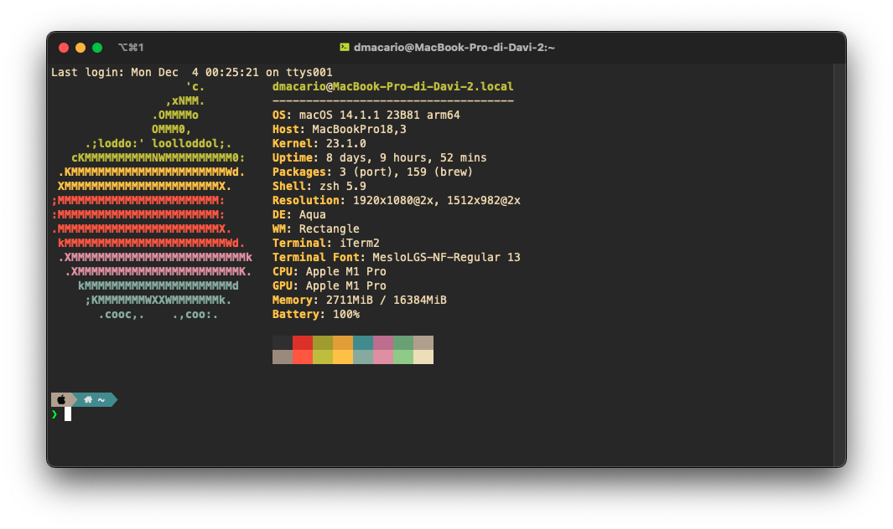

# Dotfiles - MacOS

Welcome to my dotfiles!

I am always trying new stuff, so not everything in this readme may be up-to-date.

> New terminal session
> 

> Neovim
> 

---

Did you know you could use your Mac's TouchID sensor to authenticate `sudo`? [Here](https://github.com/davmacario/sudo-with-TouchID)'s how!

---

Contents:

- [.zshrc](./.zshrc): ZSH configuration file (using Oh My Zsh)
- [.vimrc](./.vimrc): VIM configuration file (requires Vundle)
- [.p10k.zsh](./.p10k.zsh): Powerlevel10k (ZSH theme) settings file
- [nvim folder](./nvim): Neovim configuration files (using Lua)

## Requirements

- C compiler (gcc)
- [Oh My Zsh](https://ohmyz.sh/)
- [Powerlevel10k](https://github.com/romkatv/powerlevel10k)
- ~~Vim (needs to be installed via Homebrew, as default MacOS installation does not support Python)~~
- Neovim (>=0.9.0)
  - Install via Homebrew $\to$ `brew install nvim`
  - Since I switched from Vim to NVim, I first followed [this guide](https://neovim.io/doc/user/nvim.html#nvim-from-vim) - do this if you already have a working `.vimrc` and you want to import the settings
  - Now I have completely moved over from old settings, and I followed this [video](https://youtu.be/w7i4amO_zaE?si=zt8Bdg__X2dYAQwY) to get up and running (Lua is so cool!)
- `fd` (installed via brew: `brew install fd-find`
- [pngpaste](https://github.com/jcsalterego/pngpaste)
- [pomo](https://github.com/rwxrob/pomo)

Extras:

- MesloNGS LF fonts (see [this](https://github.com/romkatv/powerlevel10k/blob/master/font.md))
- Neofetch

## Neovim

### Plugins - Neovim

- Package manager: [Lazy.nvim](https://github.com/folke/lazy.nvim)
- Fuzzy finder: [Telescope](https://github.com/nvim-telescope/telescope.nvim)
- Parser: [treesitter](https://github.com/nvim-treesitter/nvim-treesitter)
- Debugger: [nvim-dap](https://github.com/mfussenegger/nvim-dap)
  - It requires to create a virtual environment where to place the [debugging engine](https://github.com/microsoft/debugpy):

```bash
mkdir "$HOME"/.virtualenvs
cd "$HOME"/.virtualenvs
python -m venv debugpy
debugpy/bin/python -m pip install debugpy
```

- [clipboard-image.nvim](https://github.com/dfendr/clipboard-image.nvim) - paste images from the clipboard to the current file (as snippet); used for Markdown
  - Using fork since original repo has a bug for Apple Silicon Macs.
- _And many more!_...

For a complete list of plugins, refer to the [plugins folder](./nvim/lua/dmacario/lazy).

### Key bindings

Here are my custom keybindings!

**Leader key**: `<space>`

- `,`: fold code
- Split view:
  - `<leader>v`: split vertically
  - `<leader>s`: split horizontally
  - `<leader>h`: focus left split
  - `<leader>l`: focus right split
  - `<leader>j`: focus bottom split
  - `<leader>k`: focus top split
- Tabs:
  - `H`: move to left tab
  - `L`: move to right tab
- Move selected lines (**visual mode**):
  - `J`: move selected lines down
  - `K`: move selected lines up
- Misc:
  - `<leader>p`: paste without losing yanked text
- LSP:
  - `gd`: go to definition (Use `Ctrl O` - note `shift-o` - to get back)
  - `K`: hover (show function definition)
  - Press `enter` to autocomplete with selection (move through selections with arrows, for now)
  - `Ctrl <space>`: toggle completion menu
- Fugitive (git utility):
  - `<leader>gs`: show git status (exit with :q)
  - `<leader>gps`: git pull
  - `<leader>gpu`: git push
- Nvim-tree (file tree):
  - `<leader>o`: toggle (on/off) tree
- Telescope (fuzzy finder):
  - `<leader>ff`: find files
  - `<leader>fg`: find git files
  - `<leader>fs`: find strings (file content - Live Grep)
  - `<leader>fb`: finding in the currently open buffers
- Harpoon:
  - `<leader>a`: add file to Harpoon
  - `Ctrl e`: toggle quick menu
  - `Ctrl h`: navigate to file '1'
  - `Ctrl t`: navigate to file '2'
  - `Ctrl n`: navigate to file '3'
  - `Ctrl s`: navigate to file '4'
- Undotree:
  - `<leader>u`: toggle undotree (on/off)
- Dap (debugger):
  - `<leader>dt`: toggle UI
  - `<leader>dB`: set breakpoint
  - `<leader>db`: toggle breakpoint
  - `<leader>dc`: continue (go to next breakpoint) or **start debugging**
  - `<leader>di`: step into
  - `<leader>dj`: down
  - `<leader>dk`: up
  - `<leader>dl`: run last
  - `<leader>do`: step out
  - `<leader>dO`: step over
  - `<leader>dp`: pause
  - `<leader>dT`: terminate
  - `<leader>dr`: reset UI
- Markdown Preview:
  - `<leader>mp`: toggle MarkdownPreview window
- Clipboard Image (paste images in editor - _Markdown_):
  - `<leader>ip`: paste image from clipboard (it will prompt to insert the image name in the folder `./img/`)
- LaTeX (VimTeX):
  - Local Leader: `"\"`
  - `\ll`: start compilation process
  - `\lk`: stop compilation
  - `\lc`: clear auxiliary files
  - `\lt`: show table of contents
  - `\lv`: open pdf (without compiling) - won't work if no pdf was generated
  - `\le`: toggle the log window (with compiler errors/warnings)
