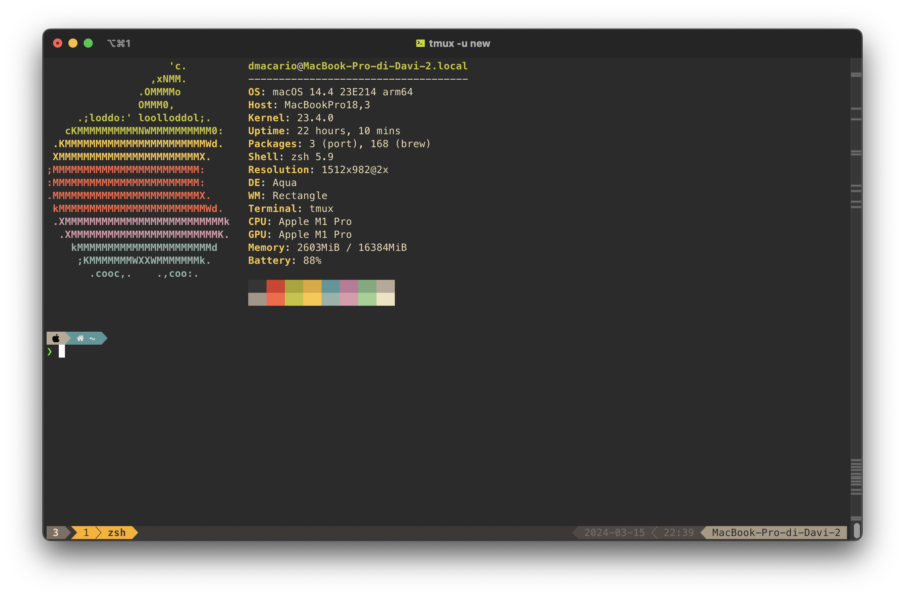
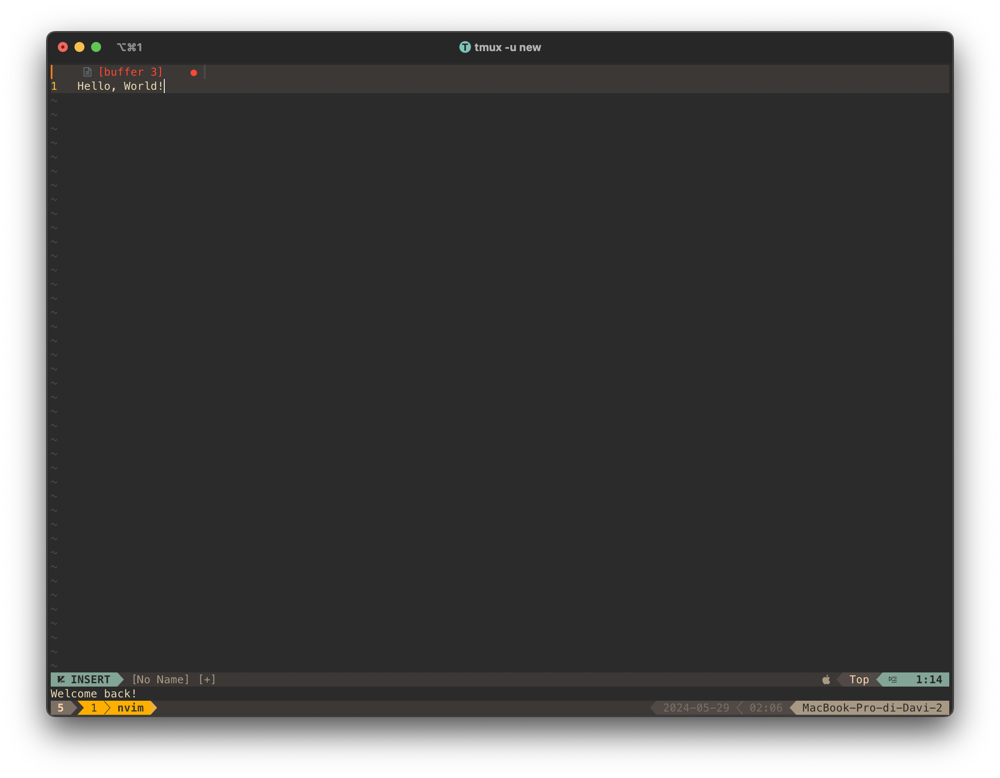

# Dotfiles - MacOS

Welcome to my dotfiles!

I am always trying new stuff, so not everything in this readme may be up-to-date.

> New terminal session
> 

> Neovim
> 

---

Did you know you could use your Mac's TouchID sensor to authenticate `sudo`? [Here](https://github.com/davmacario/sudo-with-TouchID)'s how!

---

Contents:

- [.zshrc](./.zshrc): ZSH configuration file (using Oh My Zsh)
- [.vimrc](./.vimrc): VIM configuration file (requires Vundle)
- [.p10k.zsh](./.p10k.zsh): Powerlevel10k (ZSH theme) settings file
- [nvim folder](./nvim): Neovim configuration files (using Lua)

## Requirements - ZSH

- C compiler (gcc)
- [Oh My Zsh](https://ohmyz.sh/)
- [Powerlevel10k](https://github.com/romkatv/powerlevel10k)
- [Neovim](https://neovim.io/)
  - [Packer](https://github.com/wbthomason/packer.nvim)

Extras:

- MesloNGS LF fonts (see [this](https://github.com/romkatv/powerlevel10k/blob/master/font.md))
- Neofetch

## Neovim

### Requirements

- ~~Vim (needs to be installed via Homebrew, as default MacOS installation does not support Python)~~
- Neovim (>=0.9.0)
  - Install via Homebrew $\to$ `brew install nvim`
  - Since I switched from Vim to NVim, I first followed [this guide](https://neovim.io/doc/user/nvim.html#nvim-from-vim) - do this if you already have a working `.vimrc` and you want to import the settings
  - Now I have completely moved over from old settings, and I followed this [video](https://youtu.be/w7i4amO_zaE?si=zt8Bdg__X2dYAQwY) to get up and running (Lua is so cool!)
- Package manager: [Packer](https://github.com/wbthomason/packer.nvim)
- Fuzzy finder: [Telescope](https://github.com/nvim-telescope/telescope.nvim)
- Parser: [treesitter](https://github.com/nvim-treesitter/nvim-treesitter)
- Debugger: [nvim-dap](https://github.com/mfussenegger/nvim-dap)
  - It requires to create a virtual environment where to place the [debugging engine](https://github.com/microsoft/debugpy):

```bash
mkdir "$HOME"/.virtualenvs
cd "$HOME"/.virtualenvs
python -m venv debugpy
debugpy/bin/python -m pip install debugpy
```

- _And many more!_...

For a complete list of plugins, refer to the [Packer config](./nvim/lua/dmacario/packer.lua).

### Key bindings

Here are my custom keybindings!

**Leader key**: `<space>`

- Split view:
  - `,`: fold code
  - `<leader>h`: focus left split
  - `<leader>l`: focus right split
  - `<leader>j`: focus bottom split
  - `<leader>k`: focus top split
  - `<leader>v`: split vertically
  - `<leader>s`: split horizontally
- Tabs:
  - `H`: move to left tab
  - `L`: move to right tab
- Move selected lines (**visual mode**):
  - `J`: move selected lines down
  - `K`: move selected lines up
- Misc:
  - `<leader>p`: paste without losing yanked text
- LSP:
  - `gd`: go to definition (Use `Ctrl O` - note maiusc - to get back)
  - `K`: hover (show function definition)
  - Press `enter` to autocomplete with selection (move through selections with arrows, for now)
  - `Ctrl <space>`: toggle completion menu
- Fugitive (git utility):
  - `<leader>gst`: show git status (exit with :q)
- Nerdtree (show file tree):
  - `Ctrl o`: toggle (on/off) tree
- Telescope (fuzzy finder):
  - `<leader>ff` for find files
  - `<leader>fg` for find git files
  - `<leader>fs` for find strings (file contents - Grep)
- Harpoon:
  - `<leader>a`: add file to Harpoon
  - `Ctrl e`: toggle quick menu
  - `Ctrl h`: navigate to file '1'
  - `Ctrl t`: navigate to file '2'
  - `Ctrl n`: navigate to file '3'
  - `Ctrl s`: navigate to file '4'
- Undotree:
  - `<leader>u`: toggle undotree (on/off)
- Dap (debugger):
  - `<leader>dt`: toggle UI
  - `<leader>db`: toggle breakpoint
  - `<leader>dc`: continue (go to next breakpoint) or **start debugging**
  - `<leader>dr`: reset UI
- Markdown Preview:
  - `<leader>mp`: toggle MarkdownPreview window
